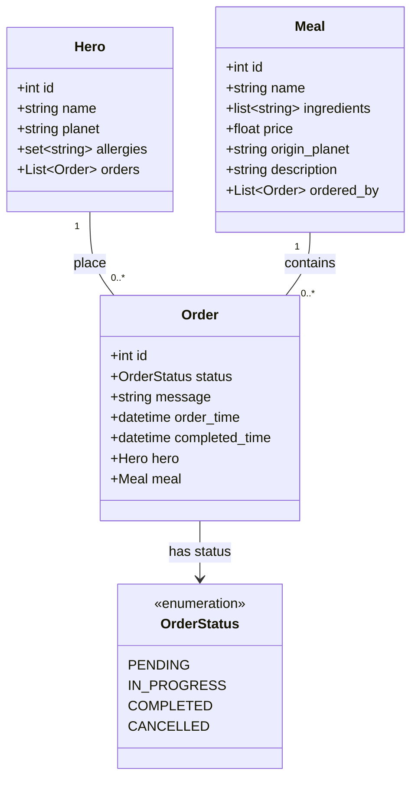
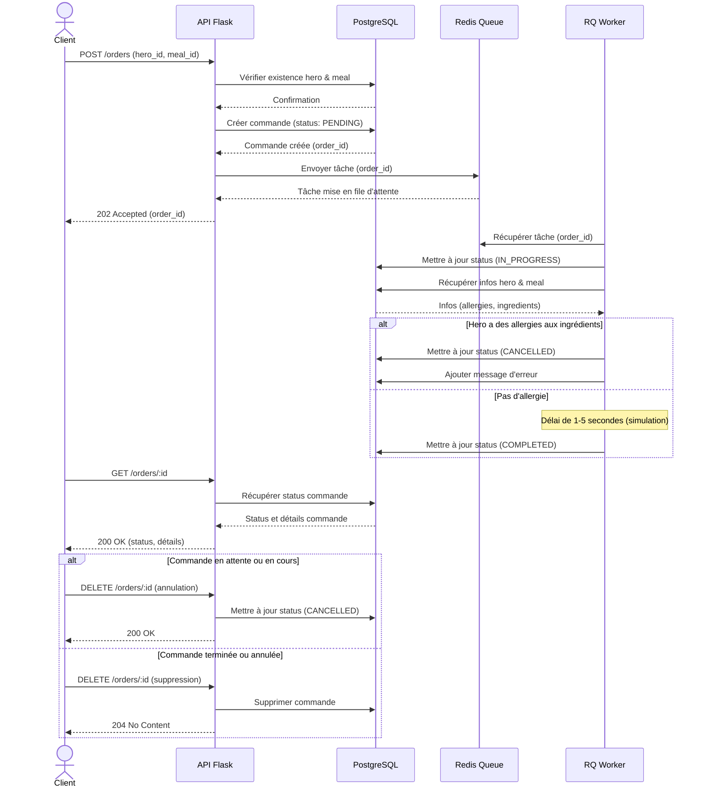
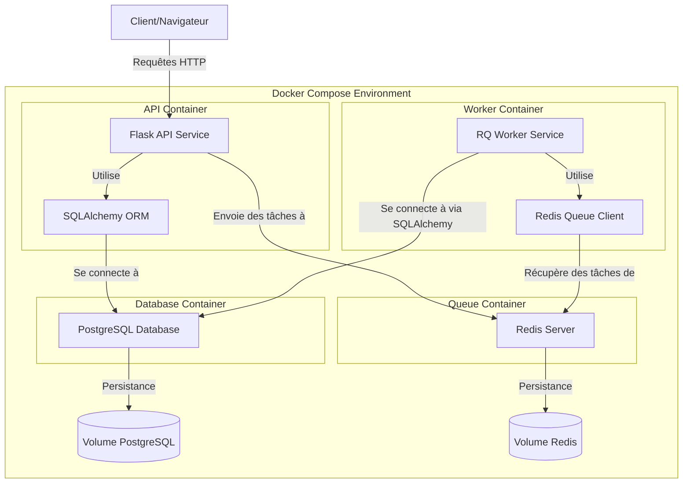

# 📋 Cas d'utilisation

## 🔄 Cas d'utilisation généraux

Pour les super-héros et les plats, vous devez considérer les cas d'utilisation classiques permettant de créer, lire,
mettre à jour et supprimer (CRUD) les entités.

La gestion des commandes doit être effectuée de manière asynchrone via un worker. Elle est détaillée ci-dessous.

## ✨ Créer une commande

Un super-héros peut commander un plat :

- La commande est créée avec le statut "en attente".
- Un message est envoyé à la file d'attente pour traiter la commande.
- Le super-héros doit être informé que la commande est en cours de traitement.

## ⚙️ Traiter une commande

Un worker doit traiter les commandes en attente dans la file d'attente :

- La commande passe en cours de traitement.
- Vérifier si le super-héros a des allergies.
- Si le super-héros a des allergies, la commande est annulée avec un message d'erreur.
- Si le super-héros n'a pas d'allergies, la commande est marquée comme "terminée".

On simulera le traitement de la commande avec un délai aléatoire de 1 à 5 secondes.

## 🔍 Obtenir le statut d'une commande

Un super-héros peut obtenir le statut de sa commande :

- La commande peut être dans l'un des états suivants : "en attente", "en cours de traitement", "terminée" ou "annulée".

## ❌ Annuler une commande

Un super-héros peut annuler ses commandes en attente ou en cours de traitement :

- La commande est annulée avec un message précisant la raison de l'annulation.

## 🗑️ Supprimer une commande

Un super-héros peut supprimer ses commandes terminées ou annulées.

# 💾 Modèle de données

Le modèle de données doit être conçu pour gérer les super-héros, les plats et les commandes. Nous vous suggérons le
modèle suivant, que vous pouvez adapter à vos besoins :

# 🔄 Diagramme de séquence

Le diagramme de séquence illustre les interactions entre les différents composants du système lors de la création et du
traitement d'une commande. Cela montre comment les données circulent entre le client, l'API Flask, la base de données
PostgreSQL et la file d'attente Redis.

Le diagramme de séquence montre le flux complet pour :

1. Créer une commande (Order)
2. Traiter cette commande via un worker asynchrone
3. Vérifier les allergies du héros par rapport aux ingrédients du repas
4. Consulter et gérer l'état de la commande

# 🐳 Diagramme d'infrastructure

Le diagramme d'infrastructure montre l'architecture de déploiement du projet avec Docker, en illustrant comment les
différents services sont configurés et communiquent entre eux.

Le diagramme d'infrastructure présente l'architecture Docker Compose avec :

- Un container pour l'API Flask
- Un container pour le worker RQ qui traite les tâches asynchrones
- Un container pour la base de données PostgreSQL
- Un container pour Redis qui sert de broker de messages
- Des volumes pour assurer la persistance des données

