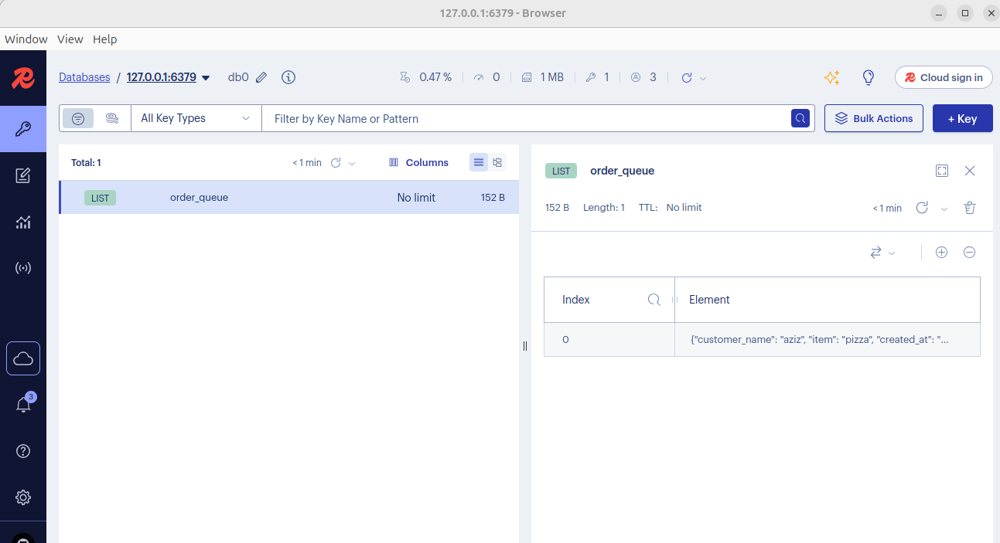

# test order pizza
## start stak
```bash
 docker compose up --build -d
```
## create order 
```bash
curl --location 'http://localhost:5000/order' \
--header 'Content-Type: application/json' \
--data '{
    "customer_name":"aziz",
    "item" : "pizza"
}'
```

##  your can use redis Insight for monitoring Queues with Gui
image 


## for checking if order registered in DB
```bash
curl --location --request GET 'http://localhost:5000/order
```

